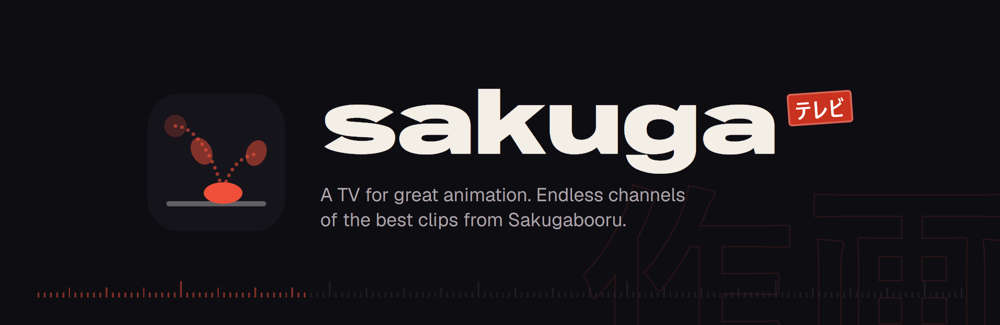
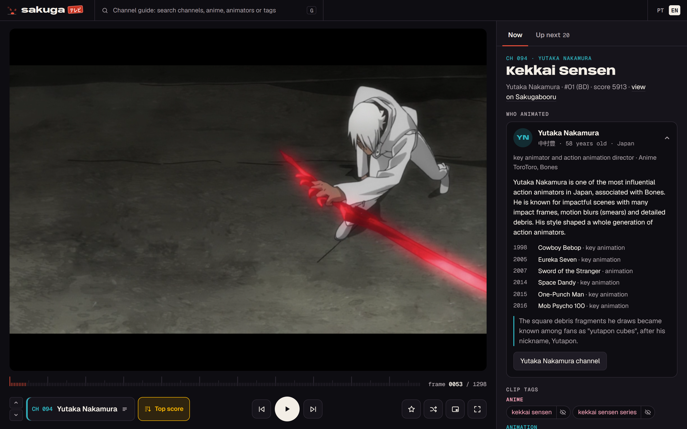
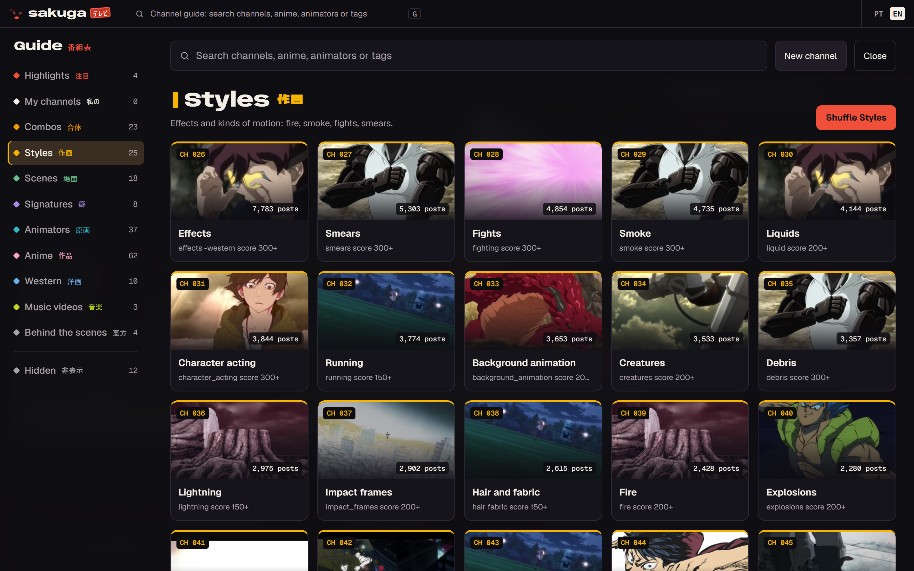
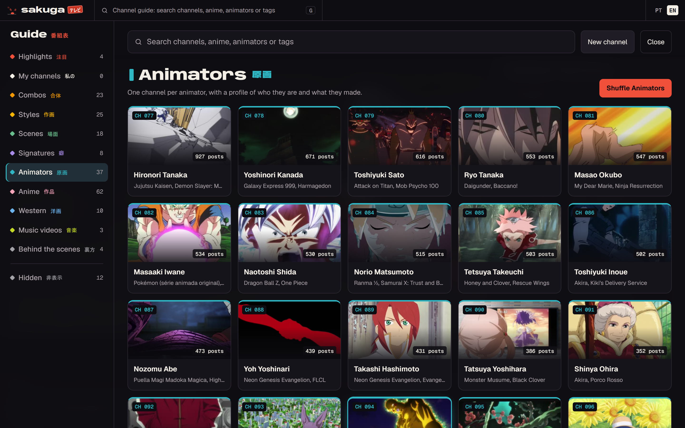
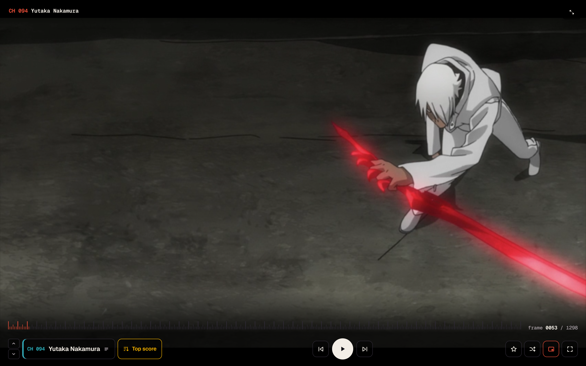
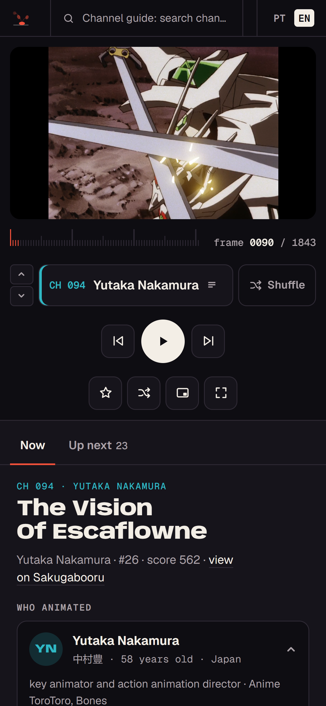

<p align="center"></p>

**SakugaTV** turns [Sakugabooru](https://www.sakugabooru.com) into a TV. Pick a channel (an animator, an anime, a kind of motion like smears or impact frames) and it plays the best clips back to back, with a profile of who animated each cut.

It's a single local page plus a tiny Node proxy, with an optional native Windows window (Rust + WebView2, under 1 MB).

<p align="center"></p>

## What it does

- **198 ready-made channels** in 10 categories: styles (fire, smoke, smears, impact frames), scenes (walk cycles, crowds, robot transformations), animator signatures (Kanada light flares, Yutapon cubes, Obari punches), 41 animators, 63 anime, western animation, music videos, behind-the-scenes material, and combos that cross a style with a group (fights with smears, idols on stage, fire and explosions).
- **A TV-style channel guide** with cover thumbnails, channel numbers and post counts. Search covers channels and any Sakugabooru tag.
- **Shuffle or top score** per channel: play at random, or from the highest-scored clip down.
- **Mix a whole category** into one stream, or shuffle everything.
- **Animator profiles** for 47 animators: original name, age, studios, key works with roles, a short bio and a bit of trivia, researched from Sakugabooru, Wikipedia, ANN and MyAnimeList.
- **Clip tags you can act on**: click a tag to open a channel with only that tag, or hide a tag on every channel for good.
- **A timesheet scrubber**: the timeline is drawn as frames at 24 fps, and the arrow keys step one frame at a time.
- **Player-only mode**: everything disappears except the video, and the controls show up when you move the mouse.
- **Native window extras**: frameless window with its own title bar, always on top, full screen.
- **Your own channels**: combine up to 6 tags, exclude others, set a minimum score.
- **English and Portuguese** interface, switchable from the top bar.

<table>
  <tr>
    <td width="50%"></td>
    <td width="50%"></td>
  </tr>
  <tr>
    <td width="50%"></td>
    <td width="50%" align="center"></td>
  </tr>
</table>

## Keyboard

| Key | Action |
|---|---|
| `G` or `/` | Open the channel guide |
| `→` `←` | Next and previous clip |
| `↑` `↓` | Next and previous channel in the same category |
| `Space` | Play and pause |
| `O` | Switch the channel between shuffle and top score |
| `Z` | Mix the current channel's category |
| `F` | Favorite the clip |
| `P` | Player-only mode |
| `T` | Full screen |
| `M` | Mute |
| `Esc` | Close the guide, leave player-only or full screen |

## Run it

You need [Node.js](https://nodejs.org) 20 or newer.

```bash
git clone https://github.com/gabrielsilvestri/sakugatv.git
cd sakugatv
node server.mjs
```

Then open http://localhost:8765. There are no dependencies to install.

### Native window (Windows, optional)

The `app/` folder is a small Rust program that opens SakugaTV in its own window using the WebView2 runtime that ships with Windows. It starts the server if it isn't running and stops it on close.

```bash
cd app
cargo build --release
./target/release/sakugatv.exe
```

### Raycast command (optional)

`raycast/` is a one-command [Raycast](https://www.raycast.com) extension that opens the native app. Run `npm install` and `npm run dev` inside it once. It finds the app on its own after the app has been opened one time.

## How it works

- `server.mjs` serves the page and proxies Sakugabooru's JSON API, which doesn't send CORS headers. Videos play straight from Sakugabooru.
- Sakugabooru accepts up to 6 regular tags per search. The server sends the channel's tags first, fills the remaining slots with exclusions and filters any extra exclusions itself. `~tag` means OR, which is how channels join seasons that have no umbrella tag.
- Channel covers come from the channel's top clips. They are fetched one request at a time and cached on disk for 14 days, to stay gentle with the site.
- Your channels, favorites, hidden tags and watch history live in `data/state.json`, outside of git.

## Customizing

- Channels live in `presets.mjs`. After adding some, run `node scripts/medir-presets.mjs`: it counts each channel's posts on Sakugabooru and lowers the minimum score until the channel has enough clips. The guide sorts by those counts.
- Animator profiles live in `public/animadores.json`, one entry per Sakugabooru artist tag.
- Machine-only channels can go in an optional `presets.local.mjs` (ignored by git), which can also add its own guide category.

## Credits

All clips, tags and scores come from [Sakugabooru](https://www.sakugabooru.com), the community archive of notable animation. SakugaTV is an unofficial fan project and isn't affiliated with Sakugabooru. If you use it, keep the request volume low.

## License

[MIT](LICENSE)
